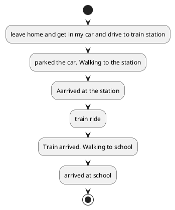
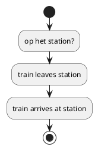
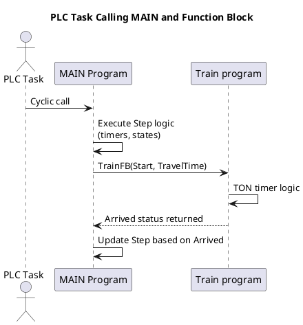
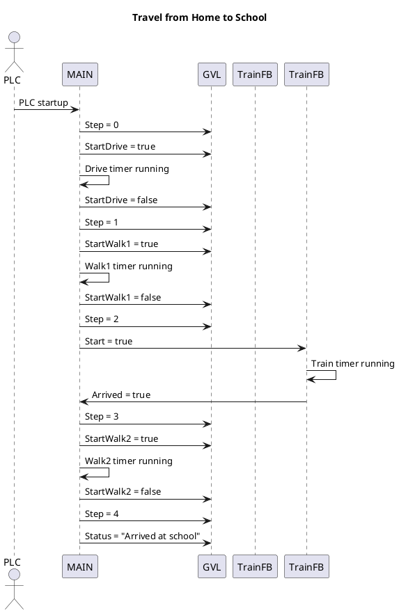

# Chapter 1

In this assignment I simulate my journey going to school from home.
below is the flowchart from the complete program

for the first car ride from my home to the train station, i have opted to use a function block. this will get called and simulate the car ride from my home to the train station.

The flowchart for the train ride is seperate, because this is a seperate program.

The train ride is programmed in a different program compared to the main program and is always running in the back until it reads the message from the Global Variable List that it has to do his part. at that point it will complete it's own case structure and communicate it back by usting the Global Variable List

The diagram below shows the calling of the program and the function.

Below is the schematic that explains the communication between the Global Variable List, the main program and the function block.
it also shows the flow of information within the program.

