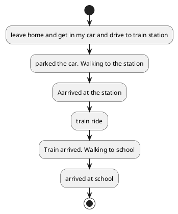
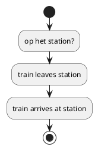
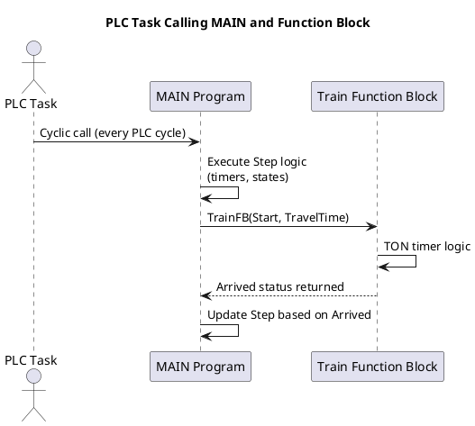
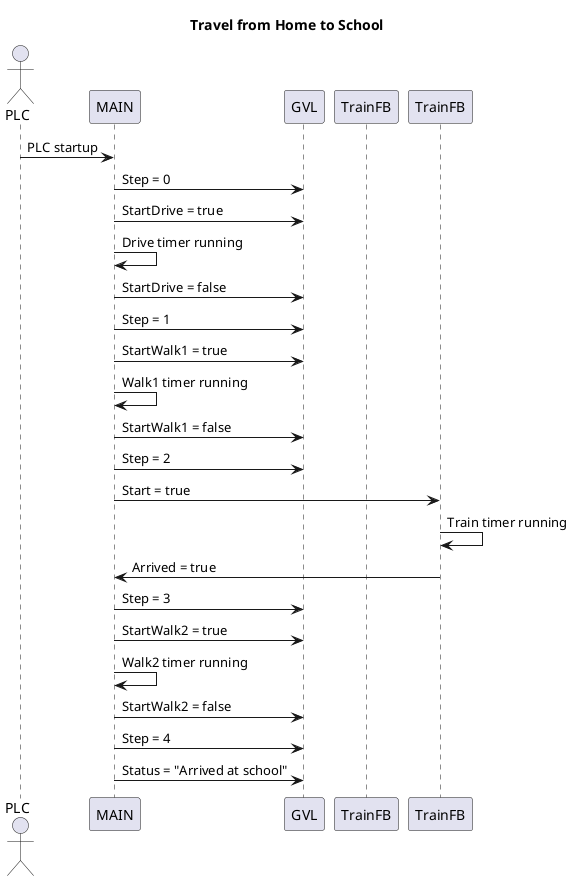

# Chapter 1

In this assignment I simulate my journey going to school from home.
below is the flowchart from the complete program

The flowchart for the train ride is seperate, because this is a seperate function.

The train ride is programmed in a function this will be called from the main program.
The diagram below shows the calling of the program and the function.

Below is the schematic that explains the communication between the Global Variable List, the main program and the function block.
it also shows the flow of information within the program.
