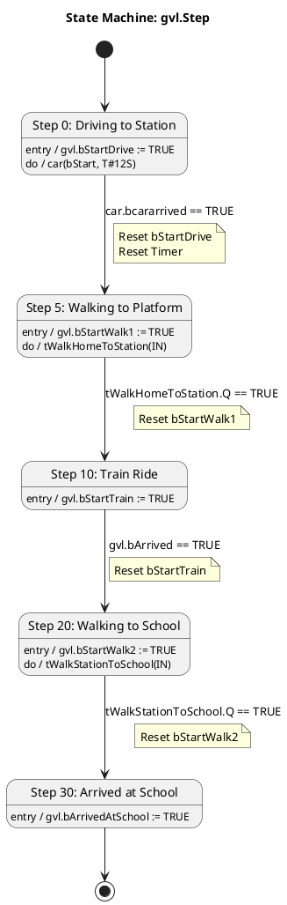
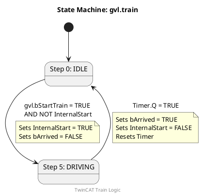
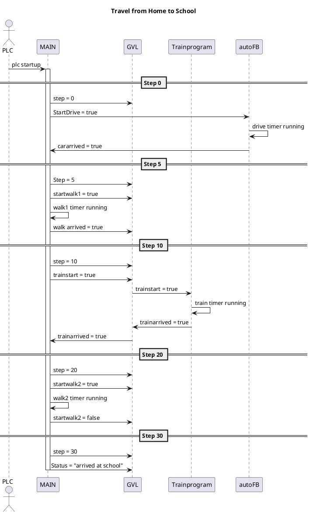
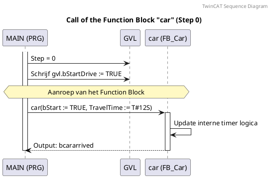

# Chapter 1

In this assignment I simulate my journey going to school from home. This is an assignment for proces and safety.

The assignment must contain:

    2 tasks running independetly(main and train program)

    the program must include 1 function(carride funciton)

    a global variable list where 2 task read and write variables in. 

For the documentation it was instructed to show:

    1 state diagram for each task

    1 diagram for showing the communication within the program

    1 sequence diagram for showing the calling of the function

below is the flowchart for the complete program this gives an overview for the reader how my journey to school is.

The statemachine for the main program is displayed below. 

The train ride is programmed in a different program compared to the main program and is always running in the back until it reads the message from the Global Variable List that it has to do his part. at that point it will complete it's own case structure and communicate it back by usting the Global Variable List. below is the corresponding state machine for it.

Below is the schematic that explains the communication between the Global Variable List, the main program, the train program and the function block.
it also shows the flow of information within the program.

for the first car ride from my home to the train station, i have opted to use a function block. this will get called and simulate the car ride from my home to the train station. below is the sequence diagram for the calling of the carride function

