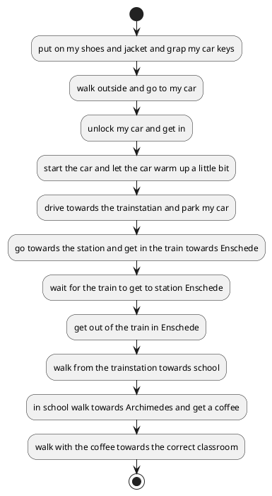

# Chapter 1

```plantuml
@startuml flowchart going to school

start
:put on my shoes and jacket and grap my car keys;
:walk outside and go to my car;
:unlock my car and get in;
:start the car and let the car warm up a little bit;
:drive towards the trainstatian and park my car;
:go towards the station and get in the train towards Enschede;
:wait for the train to get to station Enschede;
:get out of the train in Enschede;
:walk from the trainstation towards school;
:in school walk towards Archimedes and get a coffee;
:walk with the coffee towards the correct classroom; 
stop

@enduml
```