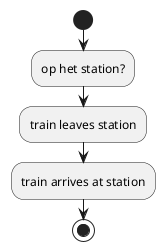
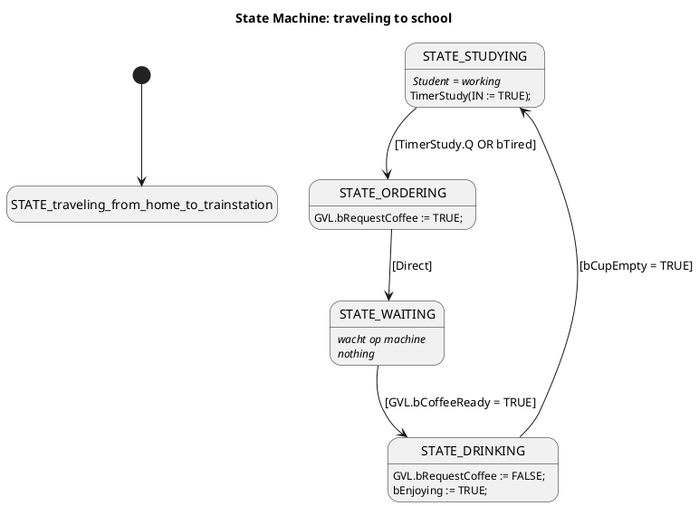

# Chapter 1

In this assignment I simulate my journey going to school

```plantuml
@startuml state diagram going to school

start
:leave home and get in my car and drive to train station;
:parked the car. Walking to the station;
:Aarrived at the station;
:train ride;
:Train arrived. Walking to school;
:arrived at school;
stop

to do:
One Sequence diagram depicting the communication between the tasks
One Sequence diagram showing the calling of the function by the task.
@enduml
```

The train ride is programmed in a function this will be called from the main program, but needed a different state diagram.



